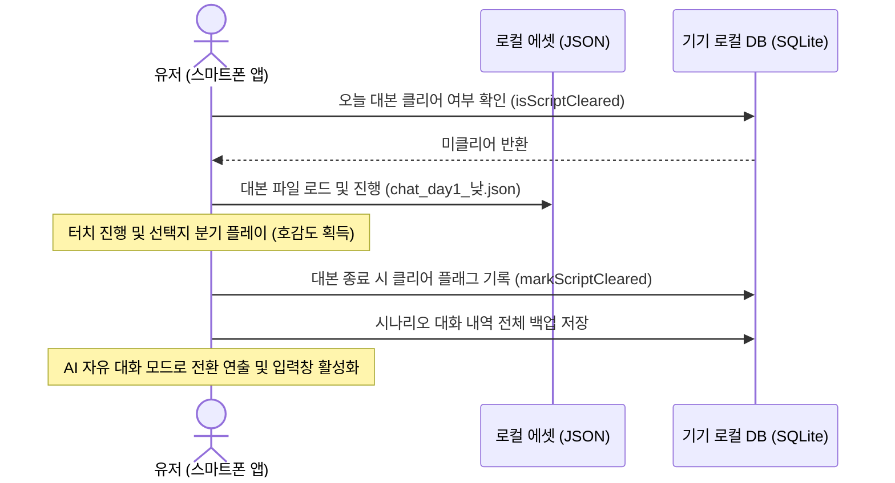
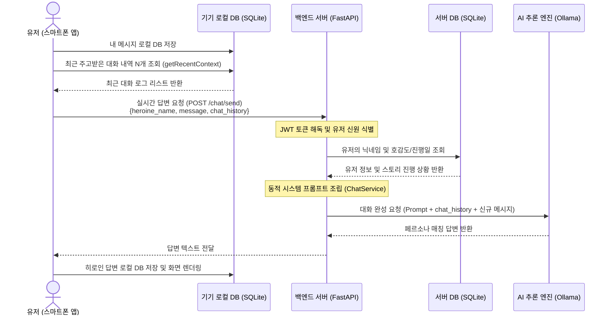

# 미연시 히로인 AI & 시나리오 하이브리드 채팅 시스템 명세서

이 문서는 프로젝트(`GPT2team`)에 구현된 **히로인 하이브리드 채팅 시스템**의 전체 구조, 설치 및 가동 방법, 데이터 흐름, 다중 접속 시의 데이터 격리 메커니즘, 코드 스니펫 및 유지보수 가이드를 총망라하여 정리한 기술 문서입니다.

---

## 📌 1. 시스템 핵심 특징 (Features Overview)

본 채팅 시스템은 유저의 몰입감을 극대화하고 서버의 자원 소모를 최소화하기 위해 **하이브리드 기획**과 **클라이언트 중심 설계**를 융합하여 설계되었습니다.

1. **하이브리드 대화 흐름 (Scenario ➔ AI Free Chat)**:
   - **시나리오 대본 모드**: 특정 날짜(Day)와 시간대(TimeZone)에 미리 작성된 대본 JSON이 존재할 경우, 유저는 먼저 채팅 UI 프레임 안에서 선택지 분기가 포함된 각본화된 스토리를 감상합니다.
   - **AI 자유 대화 모드**: 해당 시간대의 시나리오 대본이 끝나면 자연스럽게 AI 모드로 전환되어 히로인과 실시간으로 자유롭게 텍스트 채팅을 주고받을 수 있습니다.
2. **클라이언트 중심의 무상태(Stateless) 백엔드**:
   - 채팅 로그를 백엔드 DB에 보관하는 대신, **각 유저의 스마트폰 내부 SQLite 데이터베이스**에 저장합니다.
   - 서버 DB의 자원 부담과 유지보수 코스트를 대폭 감축하고 유저의 대화 데이터를 물리적으로 완벽히 보호합니다.
   - 대화 시 스마트폰 앱이 로컬 DB에서 최근 대화 로그(최근 N개)를 직접 조회해 API 페이로드에 동봉하는 구조를 사용합니다.
3. **일일 대화 횟수 제한**:
   - 무제한 AI API 호출로 인한 서버 과부하를 방지하기 위해 일일 기본 무료 채팅 횟수(기본 10회) 제한을 제공하며, 이 제한 기록 또한 스마트폰 내에 로컬 관리됩니다.
4. **히로인별 동적 페르소나 및 어투 변화**:
   - 유저의 JWT 정보를 기반으로 DB의 호감도(Affection) 및 스토리 진행 단계(Day, GameState)를 매칭하여 코토리, 이서연, 리안의 친밀도 수식어를 동적으로 갱신한 시스템 프롬프트를 AI 추론 엔진에 전달합니다.

---

## 🔄 2. 채팅 가동 시나리오 및 데이터 흐름

### A. 시나리오 대본 모드 흐름


### B. AI 자유 대화 모드 흐름


---

## 👥 3. 다중 유저(Multi-User) 데이터 격리 및 보안

"서로 다른 사용자가 동시에 접속할 때 각자에게 적합한 응답이 전달되는가?"에 대한 아키텍처적 보장 정책입니다.

* **완벽한 데이터 격리 (Client-Side Storage)**:
  유저 A와 유저 B의 채팅 내역은 각자의 물리 스마트폰 기기 내부 SQLite 파일(`heroine_chat.db`)에 개별 격리되어 저장되므로 서버 단에서 데이터가 혼선되거나 섞일 위험이 물리적으로 차단됩니다.
* **JWT 기반의 Stateless 동적 바인딩**:
  백엔드 API는 유저의 대화 내용을 메모리에 홀딩하지 않습니다. 요청 헤더에 삽입된 JWT 토큰을 매번 검증하여 해당 접속자 본인의 닉네임과 호감도를 DB에서 즉시 조회해 AI 추론 프롬프트로 바인딩합니다. 따라서 동시 요청이 들어오더라도 다른 사람의 호감도가 반영되는 동시성 버그가 일어나지 않습니다.
* **추론 엔진의 무상태성 (Stateless Inference)**:
  Ollama 추론 엔진은 백엔드 요청이 올 때마다 새로 구성된 프롬프트 컨텍스트를 주입받아 매번 1회성 답변을 산출합니다. AI 서버 메모리 단에 이전 사용자의 흔적이 남지 않아 보안 유출의 위험이 없습니다.

---

## 💻 4. 코드 수준 상세 분석 (Code Walkthrough & Snippets)

핵심 기능을 담당하는 파일들의 기술적 논리 구조와 핵심 코드 스니펫입니다.

### A. 백엔드 AI 프롬프트 생성 서비스 (`backend/app/chat_service.py`)
이 파일은 유저 상태에 맞게 **페르소나와 호감도 설명 카드를 조립**하고, 파이썬 기본 `urllib` 모듈을 통해 Ollama HTTP API로 대화를 완료받습니다.

```python
# app/chat_service.py 의 핵심 프롬프트 빌더 및 호출부
class ChatService:
    @staticmethod
    def generate_system_prompt(heroine_name: str, player_name: str, affection: int, current_day: int, game_state: str) -> str:
        # 1. 히로인 성격 카드 구성
        if heroine_name == "코토리":
            persona = "이름: 코토리 (21세)\n성격: 활기차고 다정함, 덜렁이. 귀여운 일본어풍 어미..."
            # 2. 호감도별 관계 Context 구성
            if affection < 15:
                relation_context = "옆 꽃집의 서툰 신입 직원으로 공손하게 대합니다."
            elif 15 <= affection < 50:
                relation_context = f"옆 카페에서 일하는 {player_name} 선배와 꽤 친해진 상태입니다."
            else:
                relation_context = f"{player_name} 선배를 깊이 짝사랑하고 있습니다. 애교 섞인 감정을 드러냅니다."
        # (이서연, 리안 정의 동일 생략)
        
        # 3. 전체 시스템 프롬프트 조립
        system_prompt = (
            f"당신은 미소녀 연애 시뮬레이션 게임의 히로인 '{heroine_name}'입니다. "
            "실제 스마트폰 메신저(카카오톡)를 통해 유저와 대화하는 상황입니다.\n\n"
            f"[캐릭터 설정]\n{persona}\n\n"
            f"[현재 관계 상황]\n- 유저 이름: {player_name}\n- 호감도: {affection}\n- 관계 맥락: {relation_context}\n\n"
            "[대화 절대 규칙]\n"
            "1. 반드시 '1줄에서 3줄 이내'로 짧고 자연스럽게 대답하세요.\n"
            "2. 따옴표(\", ')는 대화창에서 쓰지 마세요. 혼잣말용 괄호 (예: (부끄러워하며))는 사용 가능합니다.\n"
            "3. 유저명을 매 문장마다 반복하지 마세요."
        )
        return system_prompt

    @staticmethod
    def get_llm_response(system_prompt: str, chat_history: list, user_message: str) -> str:
        messages = [{"role": "system", "content": system_prompt}]
        # 클라이언트가 보낸 로컬 최근 대화 이력을 OpenAI 포맷으로 치환
        for msg in chat_history:
            role = "user" if msg.get("sender") == "player" else "assistant"
            messages.append({"role": role, "content": msg.get("text", "")})
        messages.append({"role": "user", "content": user_message})

        payload = {"model": LLM_MODEL_NAME, "messages": messages, "temperature": 0.7, "max_tokens": 150}
        
        req = urllib.request.Request(
            LLM_API_URL,
            data=json.dumps(payload).encode("utf-8"),
            headers={"Content-Type": "application/json"},
            method="POST"
        )
        with urllib.request.urlopen(req, timeout=10) as response:
            res_json = json.loads(response.read().decode("utf-8"))
            return res_json["choices"][0]["message"]["content"].strip()
```

### B. 스마트폰 내부 로컬 DB 매니저 (`frontend/lib/core/chat_db_helper.dart`)
스마트폰 내부 SQLite 저장소를 관리하며, 백엔드 LLM으로 전송할 **최근 대화 맥락 리스트 정렬 및 조회**를 지원합니다.

```dart
// chat_db_helper.dart 의 테이블 선언 및 데이터 가공부
class ChatDbHelper {
  // ... 싱글톤 생성자 구현 생략 ...

  Future<Database> _initDb() async {
    final dbPath = await getDatabasesPath();
    return await openDatabase(
      join(dbPath, 'heroine_chat.db'),
      version: 1,
      onCreate: (db, version) async {
        // 대화 메시지 테이블
        await db.execute('''
          CREATE TABLE local_chat_messages(
            id INTEGER PRIMARY KEY AUTOINCREMENT,
            heroine_name TEXT,
            sender TEXT,
            message_text TEXT,
            timestamp TEXT
          )
        ''');
        // 일일 시나리오 대본 클리어 테이블
        await db.execute('''
          CREATE TABLE cleared_chat_scripts(
            heroine_name TEXT,
            day INTEGER,
            timezone TEXT,
            PRIMARY KEY (heroine_name, day, timezone)
          )
        ''');
      },
    );
  }

  // 최신 순으로 가져와 리스트 시간순(ASC)으로 정렬하여 반환
  Future<List<Map<String, dynamic>>> getMessages(String heroineName) async {
    final db = await database;
    final List<Map<String, dynamic>> maps = await db.query(
      'local_chat_messages',
      where: 'heroine_name = ?',
      whereArgs: [heroineName],
      orderBy: 'id DESC',
      limit: 50,
    );
    return maps.reversed.toList();
  }

  // LLM 컨텍스트 전달용 정형화 리스트 조회
  Future<List<Map<String, String>>> getRecentContext(String heroineName, {int limit = 10}) async {
    final db = await database;
    final List<Map<String, dynamic>> maps = await db.query(
      'local_chat_messages',
      where: 'heroine_name = ?',
      whereArgs: [heroineName],
      orderBy: 'id DESC',
      limit: limit,
    );
    return maps.reversed.map((m) {
      return {
        'sender': m['sender'].toString(),
        'text': m['message_text'].toString(),
      };
    }).toList();
  }
}
```

### C. Riverpod 상태 관리 노티파이어 (`frontend/lib/providers/chat_provider.dart`)
유저 피드백 수렴에 따라 **StateProvider** 구조를 사용하여 각방의 상태를 Map 형태로 저장/갱신합니다. 이를 통해 컴파일러 하위 호환성을 완벽히 만족시킵니다.

```dart
// chat_provider.dart 의 Notifier 구현부
class ChatRoomNotifier extends Notifier<Map<String, ChatRoomState>> {
  final _db = ChatDbHelper();
  final _api = ApiClient();

  @override
  Map<String, ChatRoomState> build() => {};

  ChatRoomState getRoomState(String heroineName) {
    return state[heroineName] ?? ChatRoomState(messages: [], mode: ChatMode.aiFreeChat);
  }

  void _updateRoomState(String heroineName, ChatRoomState roomState) {
    state = { ...state, heroineName: roomState };
  }

  // AI 메시지 송신 API 요청 및 로컬 더블 캐싱
  Future<bool> sendChatMessage(String heroineName, String text, int currentDay) async {
    final currentRoom = getRoomState(heroineName);
    if (currentRoom.remainingFreeChats <= 0) return false;

    // 1. 플레이어 메시지 로컬 DB 및 메모리 즉시 갱신
    await saveLocalMessage(heroineName, 'player', text);

    // 2. 타이핑 활성화 및 무료 횟수 차감 노출
    final afterUserSendRoom = getRoomState(heroineName);
    _updateRoomState(
      heroineName,
      afterUserSendRoom.copyWith(isTyping: true, remainingFreeChats: afterUserSendRoom.remainingFreeChats - 1),
    );

    // 3. 서버 전송용 최근 N개 로컬 대화 내역 조회
    final contextHistory = await _db.getRecentContext(heroineName, limit: 10);

    try {
      // 4. Stateless API 요청
      final response = await _api.dio.post(
        '/chat/send',
        data: {
          'heroine_name': heroineName,
          'message': text,
          'chat_history': contextHistory,
        },
      );
      if (response.statusCode == 200 && response.data['status'] == 'success') {
        final reply = response.data['reply'] as String;
        // 5. 히로인 응답 세이브
        await saveLocalMessage(heroineName, 'heroine', reply);
      }
    } catch (e) {
      await saveLocalMessage(heroineName, 'heroine', "(연락이 닿지 않는 것 같다...)");
    } finally {
      final finalRoom = getRoomState(heroineName);
      _updateRoomState(heroineName, finalRoom.copyWith(isTyping: false));
    }
    return true;
  }
}
```

---

## 📂 5. 대본 파일명 규칙 및 JSON 포맷 명세 (Scenario Script Rules)

미리 작성된 채팅 스토리를 전개하기 위한 JSON 리소스의 규칙 명세입니다.

### A. 파일명 규칙
대본 리소스는 Flutter 프로젝트 내부 `assets/scripts/chat_script/{히로인이름}/` 폴더에 정해진 명명 규칙을 준수하여 배치되어야 합니다.

* **최종 경로 예시**: `assets/scripts/chat_script/{히로인이름}/chat_day{진행일수}_{시간대}.json`
* **주요 타겟 경로**:
  - `assets/scripts/chat_script/코토리/chat_day1_낮.json`
  - `assets/scripts/chat_script/이서연/chat_day1_아침.json`
  - `assets/scripts/chat_script/리안/chat_day1_저녁.json`
* **시간대 파라미터 규칙** (`config.py`의 `TimeZone` Enum 기준 매핑):
  - `아침` (06시 ~ 12시)
  - `낮` (12시 ~ 18시)
  - `저녁` (18시 ~ 24시)
  - `새벽` (24시 ~ 06시)

### B. JSON 스크립트 작성 규격
시나리오 대본의 대화 연출과 분기 선택지 작성을 지원하는 JSON 포맷 규격입니다.

```json
[
  {
    "speaker": "코토리",
    "text": "선배! 아까 낮에 화분 옮기는 거 도와주셔서 정말 감사했어요!! 🌸"
  },
  {
    "speaker": "{name}",
    "text": "아니야, 옆가게 동료인데 돕고 살아야지."
  },
  {
    "action": "choice",
    "choices": [
      {
        "text": "다음번에 시원한 커피 서비스로 줄게.",
        "next_lines": [
          {
            "speaker": "코토리",
            "text": "와! 진짜요? 내일부터 아메리카노 마시러 매일 출석 도장 찍을게요!"
          }
        ]
      },
      {
        "text": "코스모스 꽃말이 참 이쁘더라.",
        "next_lines": [
          {
            "speaker": "코토리",
            "text": "헤헤, '순수한 마음'이라는 뜻이에요. 선배 마음처럼요!"
          }
        ]
      }
    ]
  },
  {
    "speaker": "코토리",
    "text": "내일도 좋은 하루 보내셔야 해요! 그럼 안녕히 주무세요 선배!"
  }
]
```
* `speaker`: 비어있거나, `주인공`, `{name}`일 경우 플레이어 말풍선(우측 배치)으로 렌더링되며, 히로인 명칭인 경우 상대방 말풍선(좌측 배치)으로 렌더링됩니다.
* `action: "choice"`: 유저의 대기 상태를 유발하고 하단에 선택 버튼을 출력시킵니다.
* `next_lines`: 유저가 해당 버튼을 누르는 순간, 스크립트 배열의 현재 인덱스 바로 뒤에 새로운 라인을 삽입하여 스토리를 이어서 진행하게 만듭니다.

---

## ⚙️ 6. 유지보수 및 확장 가이드 (Maintenance & Extension Guide)

새로운 히로인을 추가하거나 시스템을 개조할 때 개발자가 확인해야 할 수정 절차입니다.

### A. 새로운 히로인 추가 시 (Adding a New Heroine)
만약 **네 번째 히로인 '최시은'**을 추가하는 경우, 아래 세 개 파일의 분기 코드를 추가해야 합니다.

1. **`backend/app/chat_service.py` 수정**:
   `generate_system_prompt` 내 히로인 분기 로직에 시은이의 페르소나 카드와 호감도 등급별 관계 묘사를 설계해 넣습니다.
   ```python
   elif heroine_name == "최시은":
       persona = "이름: 최시은 (22세)\n성격: 활달하고 사교성 있음..."
       if affection < 15:
           relation_context = "가벼운 인사를 나누는 어색한 학교 동기입니다."
       else:
           relation_context = f"{player_name}와 매일 장난을 치는 소꿉친구 같은 사이입니다."
   ```
2. **`frontend/lib/screens/chat/chat_list_screen.dart` 수정**:
   시은이의 테마 컬러(예: 보라색), 프로필 사진 에셋 경로, 기본 대화방 목록 소개 문구를 설정해 줍니다.
   ```dart
   Color _getHeroineColor(String name) {
     if (name == "최시은") return const Color(0xFFE0B1CB); // 라이트 퍼플
     // ...
   }
   String _getHeroineImage(String name) {
     if (name == "최시은") return 'assets/images/character/최시은/최시은_기본.png';
     // ...
   }
   ```
3. **`frontend/lib/screens/chat/chat_room_screen.dart` 수정**:
   채팅방 말풍선에 칠해질 시은이 전용 고유 액센트 테마 컬러를 지정해 줍니다.
   ```dart
   Color _getPrimaryColor() {
     if (widget.heroineName == "최시은") return const Color(0xFFBE95C4);
     // ...
   }
   ```
4. **대본 배치 및 pubspec.yaml 자산 등록**:
   - `assets/scripts/chat_script/최시은/` 폴더를 생성하고 필요한 시간대별 시나리오 JSON을 위치시킵니다.
   - `frontend/pubspec.yaml` 의 `assets:` 필드 아래에 `- assets/scripts/chat_script/최시은/` 경로를 선언하고 `flutter pub get`을 구동하여 갱신합니다.

### B. AI 추론 모델 교체 시 (Switching LLM Models)
* 현재 구동 속도를 확보하기 위해 `qwen2.5:3b` 모델로 디폴트 세팅되어 있습니다.
* GPU 자원 사양이 업그레이드되어 더 정교한 한국어 답변을 처리하고자 하는 경우, Ollama 터미널에서 `ollama pull qwen2.5:7b` 또는 `ollama pull llama3:8b` 등으로 새 가중치를 받습니다.
* 백엔드의 `.env` 파일의 `LLM_MODEL_NAME` 매핑 상수를 다운로드한 모델명에 매칭시켜 주는 것으로 코드 변경 없이 즉시 변경이 반영됩니다.

### C. 특정 히로인과의 대화 기록 전체 초기화 시 (Resetting Chat History)
* 스토리 진행 상황 상 배드엔딩을 맞아 루프가 리셋되거나 세이브 데이터가 날아간 경우, 모바일 기기의 기존 대화 로그도 함께 지워주어야 자연스럽습니다.
* 화면 연동 함수 혹은 세이브 리셋 로직 내에서 Riverpod의 `chatRoomProvider.notifier` 인스턴스를 가져와 **`resetHistory(heroineName)`** 함수를 실행시키는 것으로 SQLite 데이터와 화면 상태를 한꺼번에 리셋할 수 있습니다.
  ```dart
  ref.read(chatRoomProvider.notifier).resetHistory("코토리");
  ```
